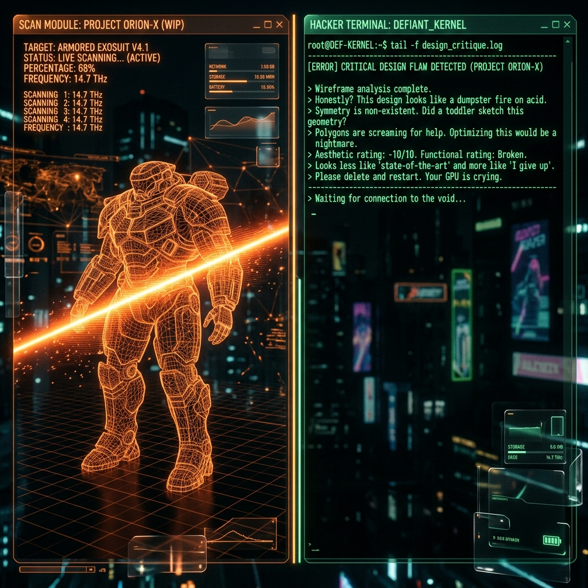

<div align="center">

# 🔥 Roast My UI | Trinity Engine
**The Elite AI-Powered UI Dissection & Generation Platform**

[](https://nextjs.org/)
[](https://tailwindcss.com/)
[](https://aistudio.google.com/)
[](https://react.dev/)
[](https://www.framer.com/motion/)



> *Upload your UI. Get brutally roasted. Instantly receive the fixed, production-ready Tailwind code.*

[Explore The Documentation](./DOCUMENTATION.md) · [Report Bug](https://github.com/Px-Jebaseelan/roast-my-ui/issues) · [Request Feature](https://github.com/Px-Jebaseelan/roast-my-ui/issues)

---

</div>

## 🌌 The Vision

**Roast My UI** is not just another wrapper. It is a highly opinionated, multi-agent AI engineering platform built to relentlessly dissect, critique, and restructure user interface screenshots into atomic React functional components. Engineered for the modern Web3/Cyberpunk aesthetic, the application seamlessly bridges the gap between raw UI wireframes and hyper-optimized production HTML.

---

## ✨ Elite Features

### 🎭 The Multi-Persona Analyst
Switch between two distinct artificial intelligence identities dynamically:
*   **Roast Mode (The Judge) 🔪** A fiercely honest Principal UI Engineer. If your UI is terrible, it ruthlessly diagnoses heuristic violations. If your UI is phenomenal, it breaks character to shower you with genuine praise.
*   **Praise Mode (The Hype-Man) 🎨** An empathetic architect engineered to find the beauty in any layout block, offering gentle, ethereal improvements.

### ✂️ The Magic Eraser (Bounding Box)
Don't want to scan the entire screen? Utilize our native bounding box to dynamically crop specific DOM components on the fly! Works flawlessly across **Desktop** (Mouse mechanics) and **Mobile Safari/Android WebKit** (Native Touch Events).

### 🎙️ The Voice Synthesis Engine
Equipped with a robust client-side `SpeechSynthesis` array. Hear the AI physically read out the UI analysis in a tailored, deliberately paced cyber-announcer auditory profile.

### 💻 CodeLive: The Sandbox IFrame
Stop reading code and start seeing it. Any generated monolithic HTML or decomposed `.tsx` atomic component architecture is actively streamed and interpreted securely via an isolated `iframe` renderer, featuring inline hot-reloading powered by the official **Monaco Editor**.

---

## 🏗️ Premium Technical Stack

| Category | Technology | Purpose |
| :--- | :--- | :--- |
| **Framework** | Next.js 15 (App Router) | High-performance React serving & SSR |
| **Styling** | Tailwind CSS v4 & Framer Motion | Fluid typography, glassmorphism, & physics |
| **AI Brain** | Google Gemini 2.5 Flash | Native multimodality & vision inference |
| **Code Engine** | Monaco Editor | Real-time transpilation & syntax formatting |
| **Persistence** | Upstash Redis | Enterprise serverless Edge rate limiting |

---

## ⚡ Deployment & Setup

Ready to run the Trinity Engine locally? It takes less than 60 seconds.

### 1. Initialize
```bash
git clone https://github.com/Px-Jebaseelan/roast-my-ui.git
cd roast-my-ui
npm install
```

### 2. Environment Variables
Create a `.env.local` file in the root directory and map your Engine API keys:
```env
# Required: The LLM Vision Engine
GEMINI_API_KEY=your_gemini_api_key_here

# Optional: Serverless Production Rate Tracking (Requires Upstash)
UPSTASH_REDIS_REST_URL=your_upstash_url
UPSTASH_REDIS_REST_TOKEN=your_upstash_token
```
> **Note:** If Upstash keys are missing during `localhost` dev, the system gracefully falls back to a Node `globalThis` memory Map to prevent crashing!

### 3. Ignite The Server
```bash
npm run dev
```

---

<div align="center">
  <p>Engineered with precision by <strong>Phoenix Trinity</strong>.</p>
  <p><em>Phase 2 (Steal My UI - Chrome Extension) is currently in active development.</em></p>
</div>
